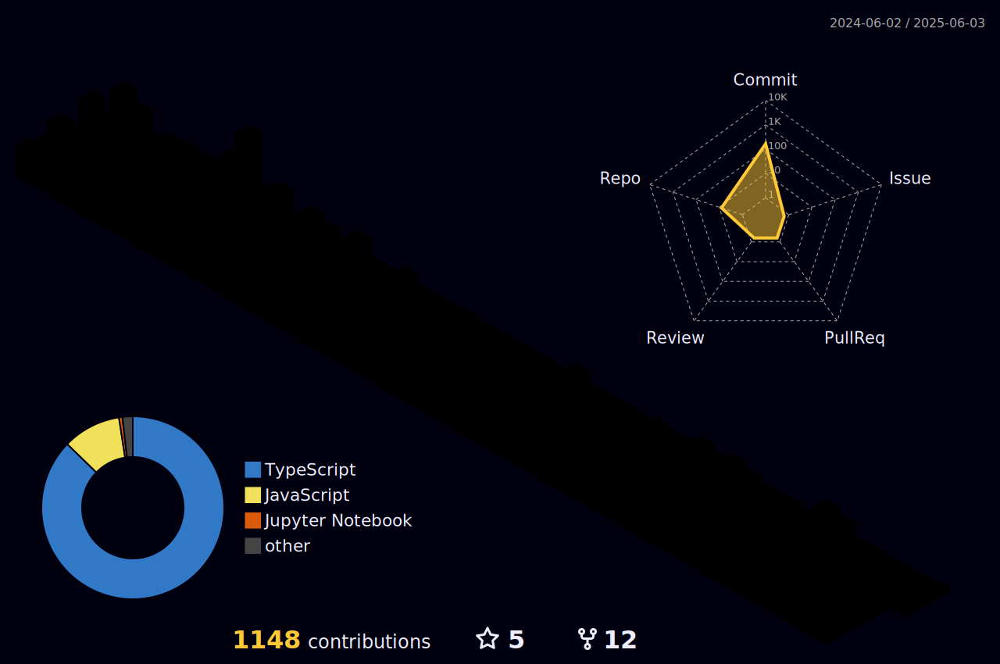

<h1 align="center">Hi  , I'm Aditya Dewangan</h1>

<!-- <h3 align="center">A Passionate Coder</h3>
<h3 align="center">Full Stack Developer</h3>-->
 

  

 

 

  
  
  

<h3 align="center">Connect with me:</h3>

  
  
  
  
  
  

<h2 align="center">Leetcode Info<h2>  
<!--

  
  
  
  

-->

  
    

# 💻 Tech Stack:

  

 

